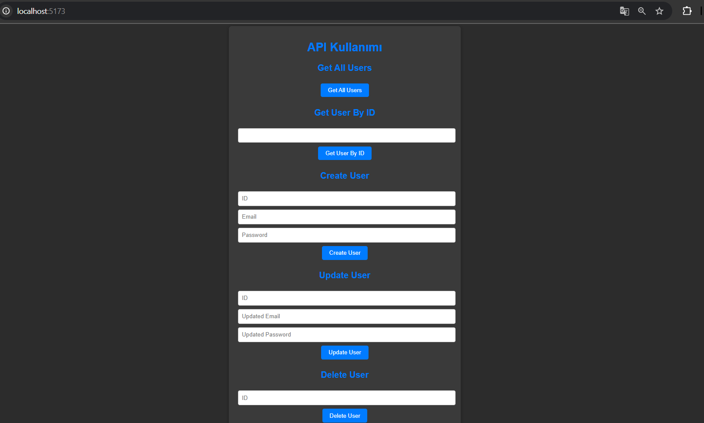

# 🚀 React ile API İstekleri Yönetimi

Bu proje, React uygulamasında API isteklerinin nasıl yönetileceğini gösteren basit bir örnek uygulamadır. Axios kütüphanesi kullanılarak GET istekleri gerçekleştirilmiştir.



## 🎯 Proje Amacı
Bu proje, modern web geliştirmede sıkça kullanılan API entegrasyonlarını öğrenmek ve uygulamak isteyenler için hazırlanmıştır. CRUD (Create, Read, Update, Delete) operasyonlarının tamamını içermektedir.

## 🛠️ Kurulum ve Çalıştırma

```bash
# Projeyi klonlayın
git clone [https://github.com/kadirn7/API-UsingReact]

# Proje dizinine gidin
cd API-Using

# Bağımlılıkları yükleyin
npm install

# JSON Server'ı başlatın
json-server --watch src/db.json --port 3000

# Yeni bir terminal açın ve React uygulamasını başlatın
npm run dev
```

## 📋 Özellikler

- Tüm kullanıcıları listeleme
- ID'ye göre kullanıcı getirme
- JSON Server ile mock API kullanımı
- Yeni kullanıcı oluşturma
- ID'ye göre kullanıcı güncelleme
- ID'ye göre kullanıcı silme

## 💡 Kullanım Örnekleri

### 👥 Kullanıcıları Listeleme
```javascript
const getUsers = async () => {
  try {
    const response = await axios.get('http://localhost:3000/users');
    setUsers(response.data);
  } catch (error) {
    console.error('Kullanıcılar getirilirken hata oluştu:', error);
  }
};
```

### 🔍 ID ile Kullanıcı Getirme
```javascript
const getUserById = async (id) => {
  try {
    const response = await axios.get(`http://localhost:3000/users/${id}`);
    setSelectedUser(response.data);
  } catch (error) {
    console.error('Kullanıcı getirilirken hata oluştu:', error);
  }
};
```

## 🔍 API Endpoints

| Endpoint | Metod | Açıklama | Örnek İstek |
|----------|--------|----------|-------------|
| /users | GET | Tüm kullanıcıları getirir | `GET http://localhost:3000/users` |
| /users/:id | GET | ID'ye göre kullanıcı getirir | `GET http://localhost:3000/users/1` |
| /users | POST | Yeni kullanıcı oluşturur | `POST http://localhost:3000/users` |
| /users/:id | PUT | ID'ye göre kullanıcı günceller | `PUT http://localhost:3000/users/1` |
| /users/:id | DELETE | ID'ye göre kullanıcı siler | `DELETE http://localhost:3000/users/1` |

## 🛠️ Kullanılan Teknolojiler

- React v18
- Axios
- JSON Server
- Vite
- CSS3 (Modern Grid ve Flexbox özellikleri)

## 📝 Önemli Notlar

- JSON Server'ın çalışması için `db.json` dosyasının `src` klasörü içinde olduğundan emin olun
- API istekleri için varsayılan port: 3000
- React uygulaması varsayılan port: 5173
- Projeyi geliştirme ortamında test etmek için JSON Server'ın çalışır durumda olması gerekir

## 🔄 Gelecek Güncellemeler

- [ ] Authentication sistemi eklenmesi
- [ ] Kullanıcı rollerine göre yetkilendirme
- [ ] Arama ve filtreleme özellikleri
- [ ] Sayfalama sistemi
- [ ] Dark/Light tema desteği

## 🤝 Katkıda Bulunma

1. Bu projeyi fork edin
2. Yeni bir branch oluşturun (`git checkout -b feature/amazing-feature`)
3. Değişikliklerinizi commit edin (`git commit -m 'feat: Add amazing feature'`)
4. Branch'inizi push edin (`git push origin feature/amazing-feature`)
5. Pull Request oluşturun

## 📜 Lisans

MIT © [2024] [kadirn7]

## 📞 İletişim

Kadir Neidik - [@kadirn7](https://github.com/kadirn7)

Proje Linki: [https://github.com/kadirn7/API-UsingReact](https://github.com/kadirn7/API-UsingReact)
